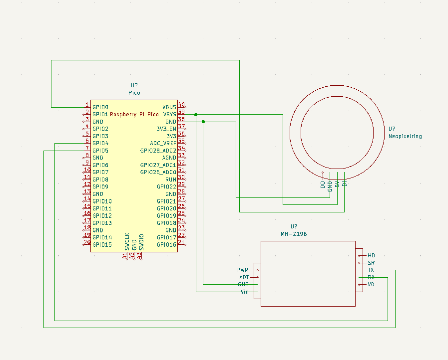
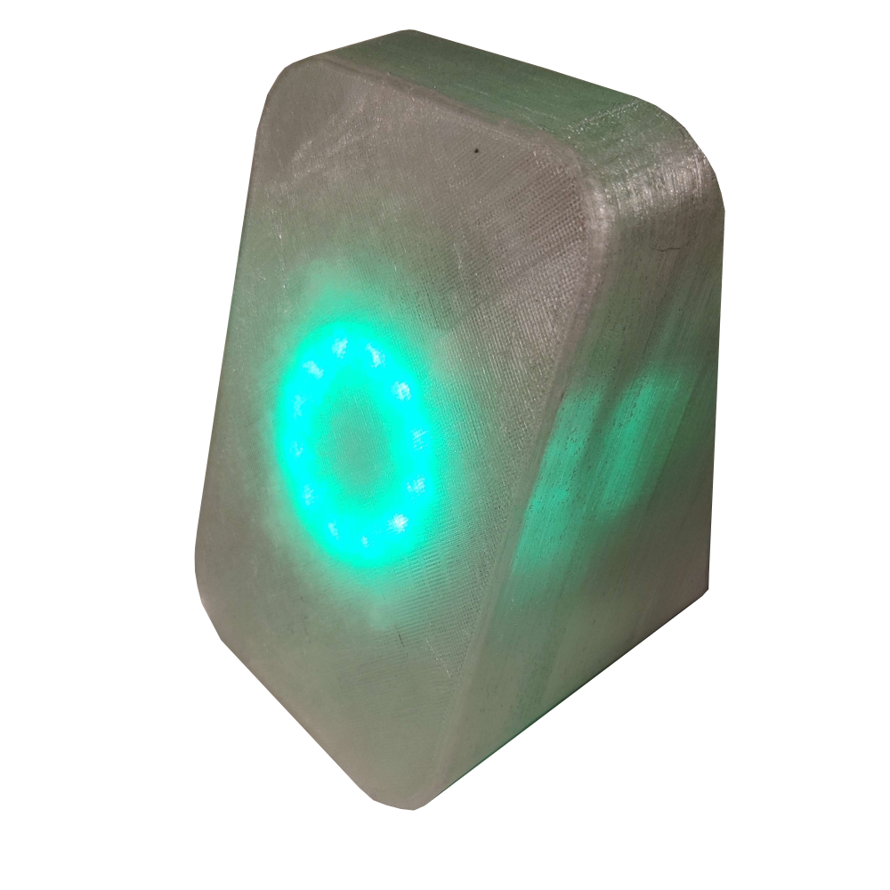
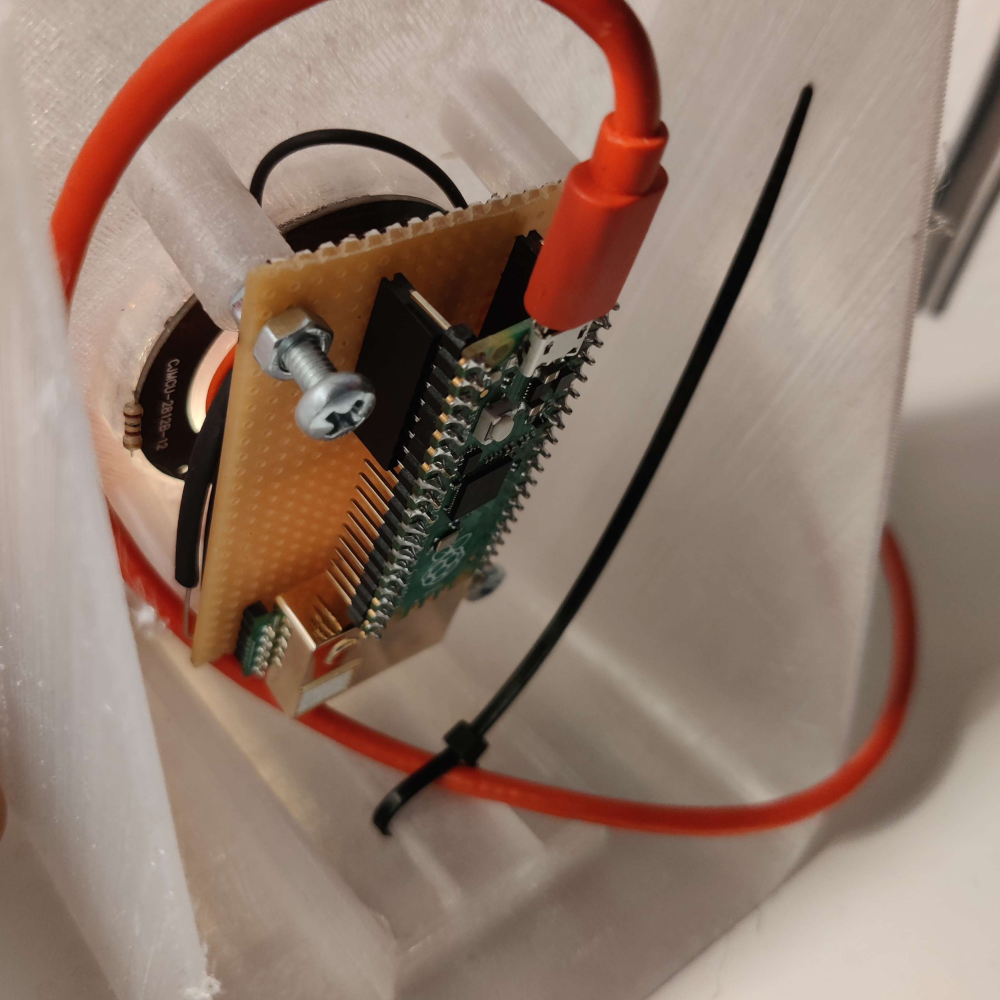

# PiCO2
A small Co2 Indicator using a MH-Z19B and a Raspberry Pi Pico, written in Micropython. It shows the current amount of Co2 in the Enviroment to be read and understood at a glance.

## Schematic

## Housing

## Authors 

The Project is based on Code by [Artem Smotrakov](https://github.com/artem-smotrakov), whose MHZ19BSensor Class i picked for the great Errorchecking of the UART Messages. I altered the Code to integrate the Neopixel LEDs for my apllication.
The original Project may be found [here](https://github.com/artem-smotrakov/esp32-weather-google-sheets/blob/master/src/weather.py)
   
